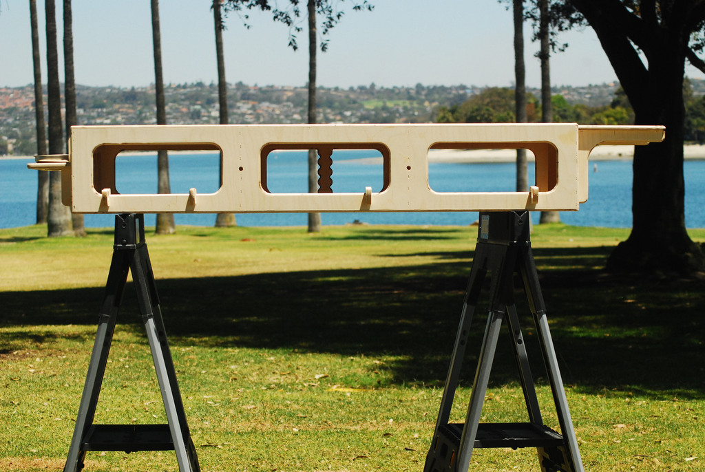

## Établi mobile

Ce dossier contient les fichiers de design et de fabrication pour une fraiseuse à commande numérique (fichier DXF et [GALAAD](http://www.galaad.net/home-fra.html "Site du soft Galaad")).

###Sources
Le design a été recréé à partir de l'idée du [WorkBench d'Obrary](http://obrary.com/products/makerbench-series-3 "Workbench d'Obrary").

### Modifications
Les modifications suivantes ont été apportées :
* Passage aux unités métriques
* Adaptation à un panneau de 12 mm d'épaisseur
* Ajout d'un montant interne supplémentaire pour augmenter la rigidité.

### Arborescence
**Sources** : les fichiers dxf ainsi que le fichier freeCAD contenant le design initial. Voir sources/README pour plus d'informations.

**galaad** : fichier de configuration de Galaad pour l'usinage
